<h2 style="margin: 30px 0 30px; text-align: center; font-weight: bold;">Basic Cloud Platform</h2>
<h4 style="text-align: center;">基于 Spring Cloud 生态的现代化微服务平台</h4>

---
<div style="text-align: center">

[](https://deepwiki.com/vains-Sofia/basic-cloud-platform)
[](https://docs.spring.io/spring-boot/index.html)
[](https://docs.spring.io/spring-authorization-server/reference/index.html)
[](https://docs.spring.io/spring-cloud-release/reference/index.html)
[](https://sca.aliyun.com/)
[](https://springdoc.org/)
[](https://baomidou.com/)
[](https://docs.spring-boot-admin.com/3.4.5/docs/index)
[](https://www.graalvm.org/)
[](https://nacos.io)
[](https://maven.apache.org/)
[](./LICENSE)
-blue)

</div>

---

### 📋 项目简介

Basic Cloud Platform 是一个基于 Spring Cloud 生态体系构建的现代化微服务平台。本项目采用最新的 Spring Cloud 技术栈，集成了统一授权认证、服务治理、微服务监控等核心功能，为企业级应用开发提供完整的解决方案。

### 🤖 DeepWiki
[](https://deepwiki.com/vains-Sofia/basic-cloud-platform)<br />
现在项目已使用 DeepWiki 自动生成wiki，您可访问 https://deepwiki.com/vains-Sofia/basic-cloud-platform 或点击上方icon来查看。<br />
DeepWiki 是一个 AI 驱动的知识库，旨在帮助开发者更高效地获取项目相关信息。您可以通过 DeepWiki 提问，获取关于 Basic Cloud Platform 的详细解答和使用指导。

### ⭐ 如果这个项目对您有帮助，请点个Star支持一下！

您的支持是我们持续改进和维护项目的动力！如果您觉得项目不错，请：
- 给项目点个Star
- 分享给更多需要的朋友
- 提交Issue帮助我们改进
- 贡献代码让项目更完善

### 🔗 相关项目

- **前端项目**：[Basic Cloud Platform UI](https://gitee.com/vains-Sofia/basic-cloud-platform-ui) - 基于 Vue3 + TypeScript 的现代化前端管理系统
- **感谢开源**：本项目前端基于 [Pure Admin](https://gitee.com/yiming_chang/pure-admin-thin) 脚手架构建，感谢Pure Admin提供的优秀前端解决方案

### ✨ 核心特性

- **统一认证中心**：基于 Spring OAuth2 Authorization Server 实现，支持多种认证方式
- **微服务网关**：使用 Spring Cloud Gateway，实现统一的API路由和安全控制
- **实时监控**：集成 Spring Boot Admin，提供实时的服务监控和告警能力
- 🛠**系统服务**：完整的用户、角色、权限管理体系
- **分布式架构**：基于 Spring Cloud 实现服务注册发现、配置管理等

### 🔧 功能列表

#### 🔐 认证中心服务 (basic-service-authorization-server)
- **OAuth2 应用管理**：应用注册、配置管理、密钥管理
- **OAuth2 授权管理**：令牌管理、下线令牌、授权码管理
- **OAuth2 作用域管理**：API 访问范围定义和控制
- **验证码服务**：图形验证码生成和验证
- **二维码授权**：移动端扫码登录支持
- **认证页面管理**：登录页面、授权确认页面定制

#### 🏛️ 系统管理服务 (basic-service-system)
- **用户管理**：用户增删改查、用户状态管理、密码管理
- **角色管理**：角色定义、权限分配、角色层级管理
- **权限管理**：菜单权限、按钮权限、数据权限控制
- **字典管理**：数据字典类型和项目管理
- **公共接口**：文件上传、下载等通用功能
- **第三方用户绑定**：微信、Gitee、GitHub 等三方账号绑定管理

#### 🌐 网关服务 (basic-service-gateway)
- **统一路由**：API 请求路由和负载均衡
- **安全控制**：请求鉴权(可选)
- **跨域处理**：CORS 跨域请求支持

#### 📊 监控中心 (basic-service-monitor)
- **服务监控**：微服务健康状态实时监控
- **性能指标**：JVM、数据库、缓存性能监控
- **日志管理**：集中式日志查看和分析
- **告警通知**：异常状态自动告警

#### 📝 接口文档
- **Swagger 集成**：自动生成 API 文档
- **在线调试**：接口在线测试功能
- **认证集成**：文档页面支持 OAuth2 登录测试

#### 🔄 分布式特性
- **服务注册发现**：基于 Nacos 的服务治理
- **配置中心**：集中化配置管理和动态更新
- **分布式锁**：Redis 分布式锁支持

#### 🔑 登录方式
- **二维码登录**：支持移动端扫码登录，方便快捷
- **邮件验证码登录**：支持通过邮箱验证码进行登录，增强安全性和用户体验
- **账号密码登录**：传统的用户名和密码登录方式，兼容性强
- **第三方登录**：支持微信、Gitee、GitHub 等第三方账号登录，提升用户注册和登录体验

#### 🎫 支持的 OAuth2 Grant Types
##### 默认支持
- **Authorization Code**：支持 OAuth2 授权码模式，适用于用户授权的场景
- **PKCE**：支持 OAuth2 PKCE 模式，增强移动端和公共客户端的安全性
- **Client Credentials**：支持 OAuth2 客户端模式，适用于机器对机器的场景
- **Refresh Token**：支持使用刷新令牌获取新的访问令牌，延长会话有效期

##### 自定义支持
- **密码模式**：支持 OAuth2 密码模式登录，适用于信任的客户端
- **邮件验证码**：支持通过邮件验证码进行登录，增强安全性(类似密码模式，未加入配置)

### 🖼️ 演示图片

#### 🔐 登录认证
| 账号密码登录 | 邮箱验证码登录 | 二维码登录 |
|-------------|-------------|-----------|
| 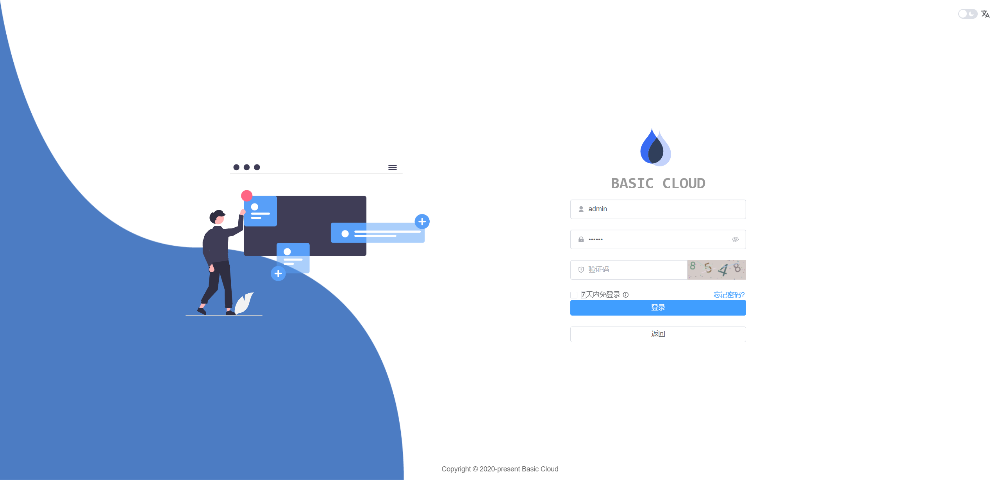 | 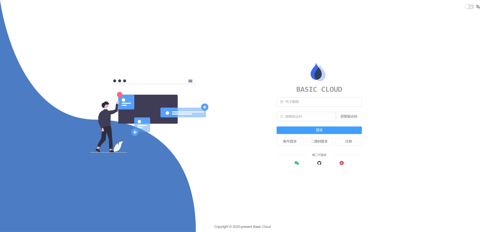 |  |

#### 🛠️ 系统管理
| 用户管理 | 角色管理 | 权限管理 |
|---------|---------|---------|
| 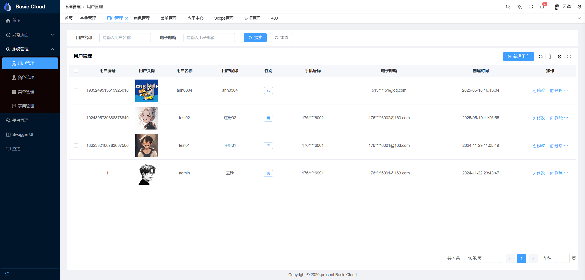 | 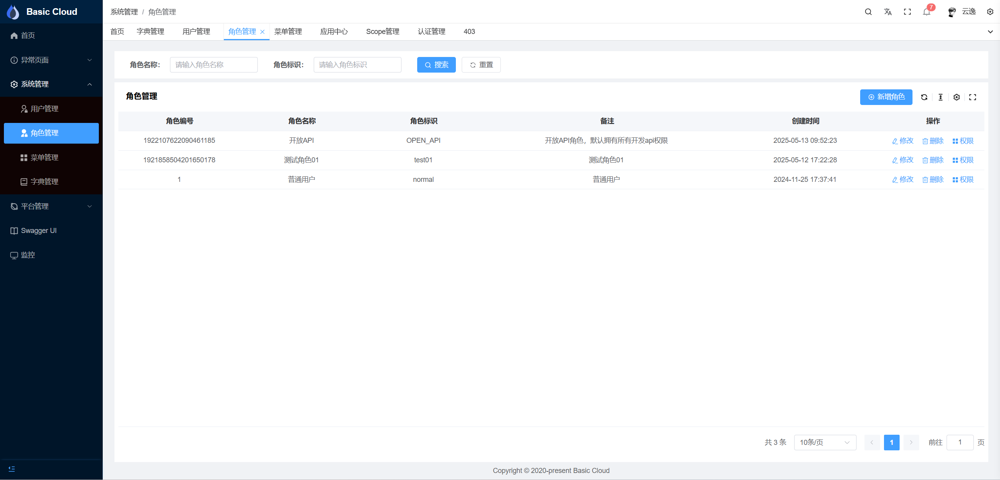 | 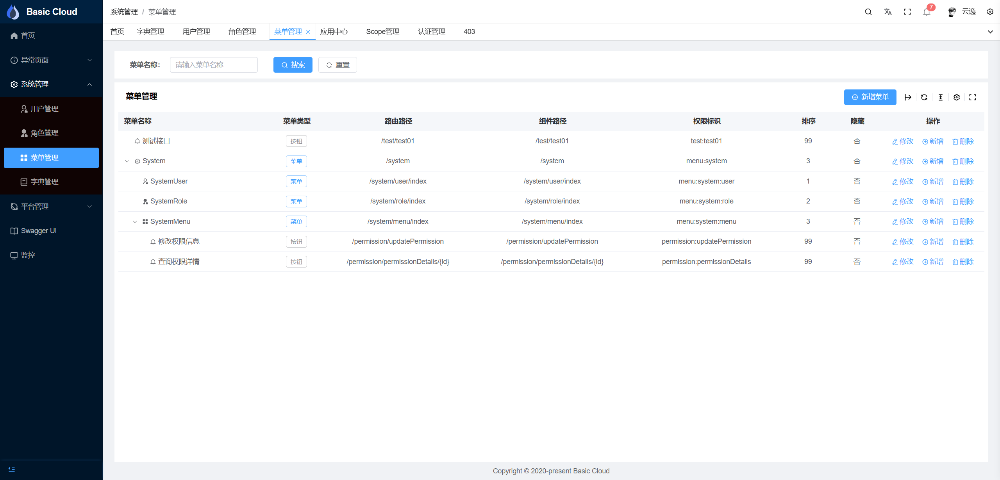 |

#### 🔧 OAuth2 管理
| 应用管理 | 应用详情 | 授权管理 |
|---------|---------|---------|
| 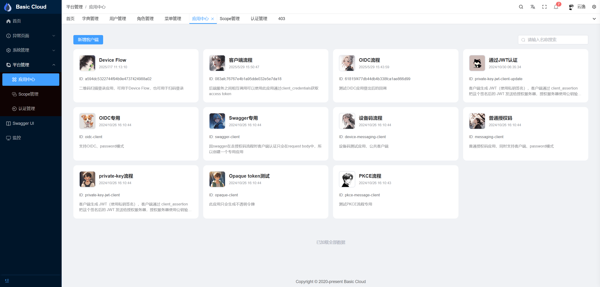 | 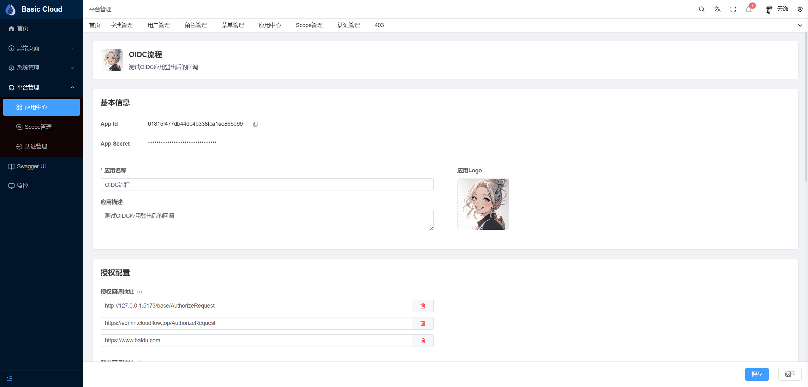 | 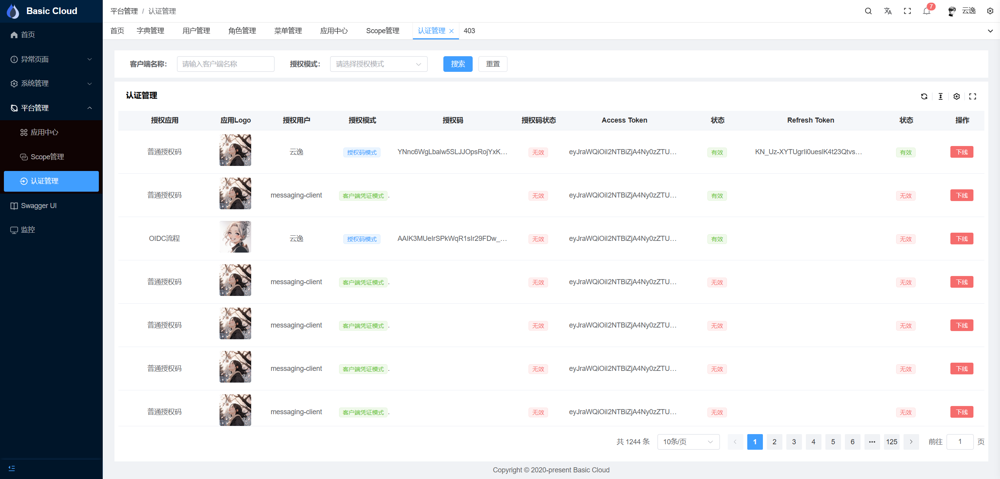 |

| 作用域管理 | 字典管理 | 用户注册 |
|-----------|---------|---------|
| 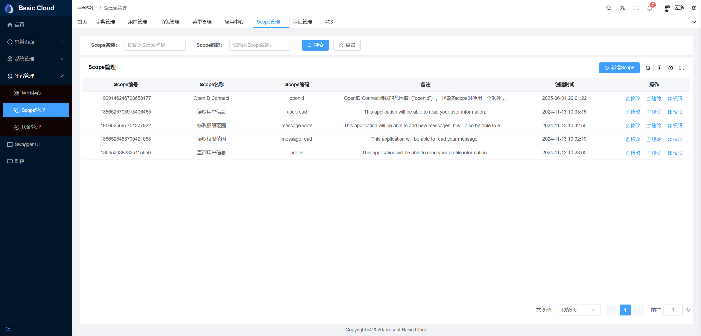 |  | 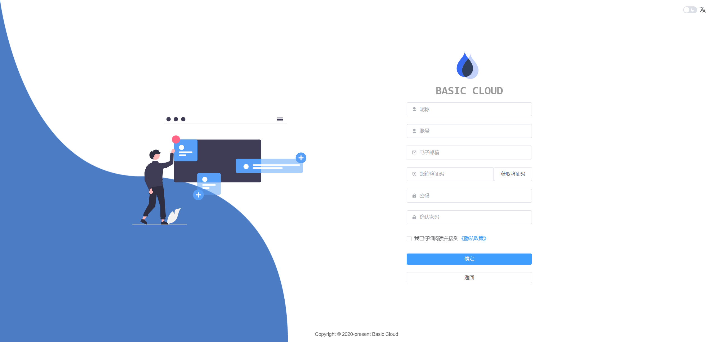 |

#### 📊 监控与文档
| Swagger API文档 | Spring Boot Admin监控 |
|----------------|----------------------|
| 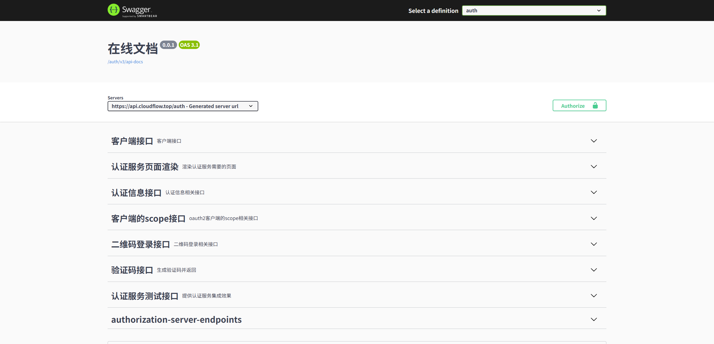 | 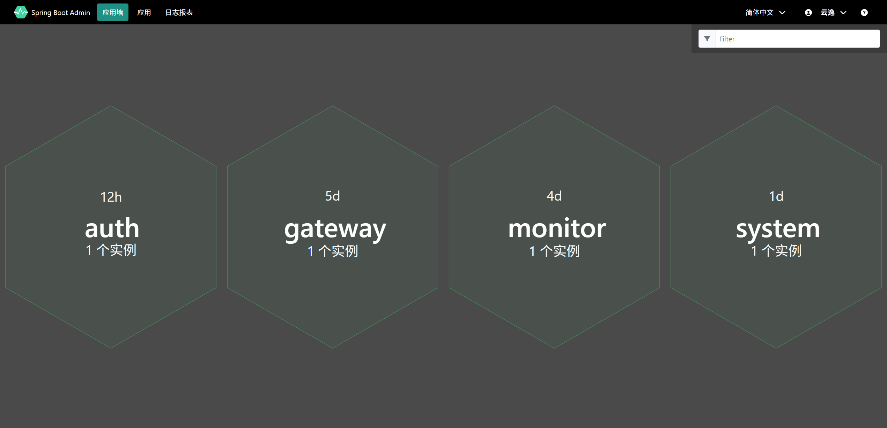 |

### 🛡️ 技术栈

- **基础框架**：Spring Boot 3.4.4 | Spring Cloud 2024.0.1
- **安全框架**：Spring OAuth2 Authorization Server 1.4.2
- **微服务组件**：Spring Cloud Alibaba 2023.0.3.2 | Nacos 2.5.1
- **持久层**：Mybatis Plus 3.5.11 | Spring Data JPA
- **接口文档**：Spring Doc 2.8.6
- **监控组件**：Spring Boot Admin 3.4.5
- **运行环境**：Java 21+ | Maven 3.9.9

### 📁 项目结构

```shell
|-- basic-cloud-platform
    |-- pom.xml                                                 -- 根pom.xml
    |-- basic-examples                                          -- 示例项目
    |   |-- basic-example-data-jpa                              -- Jpa封装使用示例
    |   |-- basic-example-doc                                   -- SpringDoc封装使用示例
    |   |-- basic-example-mybatis-plus                          -- Mybatis-Plus封装使用示例
    |   |-- basic-example-redis                                 -- Redis封装使用示例
    |   |-- basic-example-resource-server                       -- 资源服务器使用示例
    |-- basic-framework
    |   |-- basic-framework-core                                -- framework核心包
    |   |-- basic-framework-data-jpa                            -- Spring Data Jpa封装，实体统一父类，自动设置审计信息，统一枚举转换
    |   |-- basic-framework-data-redis                          -- Spring Data Redis封装，RedisTemplate封装，Redis分布式锁封装
    |   |-- basic-framework-data-validation                     -- Spring Data Validation封装，统一参数校验
    |   |-- basic-framework-mybatis-plus                        -- Mybatis-Plus封装，统一分页查询，统一枚举转换
    |   |-- basic-framework-oauth2                              -- 认证相关framework
    |   |   |-- basic-framework-oauth2-authorization-server     -- 认证服务封装，扩展登录、Grant Type、Token、Client等
    |   |   |-- basic-framework-oauth2-core                     -- 认证核心模块封装
    |   |   |-- basic-framework-oauth2-federation               -- 联合身份认证封装，支持三方登录
    |   |   |-- basic-framework-oauth2-resource-server          -- 资源服务器封装，同时支持JWT、Opaque Token
    |   |   |-- basic-framework-oauth2-storage                  -- 认证中心存储实现，目前基于db存储
    |   |   |-- basic-framework-oauth2-storage-old              -- 认证中心存储实现，支持多种存储，弃用
    |   |-- basic-framework-openfeign                           -- 远程调用封装，FeignClient支持RequestMapping注解
    |   |-- basic-framework-spring-doc                          -- Spring Doc封装，支持展示枚举、使用认证中心登录等
    |   |-- basic-framework-web                                 -- Spring Web封装，支持统一异常处理、统一返回结果、统一参数校验
    |-- basic-services                                          -- 项目微服务模块
    |   |-- basic-service-authorization-server                  -- Spring OAuth2 Authorization Server认证中心服务
    |   |-- basic-service-gateway                               -- Spring Cloud Gateway网关服务
    |   |-- basic-service-monitor                               -- Spring Boot Admin监控服务
    |   |-- basic-service-system                                -- 系统服务，包含用户、角色、权限等
    |-- basic-services-api                                      -- FeignClient远程调用api模块
    |   |-- basic-service-system-api                            -- 系统服务相关 API
    |-- docs                                                    -- 文档相关
        |-- deploy                                              -- 部署相关
        |   |-- Centos
        |   |   |-- deploy.sh                                   -- 服务器部署脚本
        |   |-- docker
        |   |   |-- Dockerfile                                  -- 服务部署至docker时打包使用的Dockerfile
        |   |   |-- infra
        |   |       |-- infra-compose.yml                       -- 服务依赖的组件，如数据库、Nacos等
        |   |-- yaml-backup                                     -- 备份的yaml文件
        |       |-- application-authorization-server.yml
        |-- nacos
        |   |-- nacos_config_dev.zip                            -- nacos配置中心dev环境配置
        |   |-- nacos_config_test.zip                           -- nacos配置中心test环境配置
        |-- sql                                                 -- 项目数据库相关
            |-- basic-cloud-platform-dev.sql                    -- 项目数据库脚本
            |-- basic-cloud-platform-test.sql                   -- 项目测试数据库脚本
```


### 🚀 快速开始

1. **环境准备**
   ```bash
   # 克隆项目
   git clone https://gitee.com/vains-Sofia/basic-cloud-platform.git
   ```

2. **基础组件启动**
   ```bash
   cd ops/deploy/docker/infra
   docker-compose -f infra-compose.yml up -d
   ```

3. **数据库初始化**
   ```sql
   -- 创建数据库
   create database `basic-cloud-platform` character set utf8mb4 collate utf8mb4_bin;
   
   -- 导入数据：
   -- ops/sql/basic-cloud-platform-dev.sql
   ```

4. **配置导入**
    - 导入 `ops/nacos/nacos_config_dev.zip` 到 Nacos 配置中心
    - 更新配置中心中相关组件（MySQL、Redis等）的连接信息

5. **服务启动**<br />
   按顺序启动以下服务：
    - basic-service-authorization-server（认证中心）
    - basic-service-gateway（网关服务）
    - basic-service-system（系统服务）
    - basic-service-monitor（监控中心）

### 🌐 访问地址

| 服务 | 地址 | 描述 |
|------|------|------|
| 网关服务 | http://127.0.0.1:9000 | 统一入口 |
| Swagger文档 | http://127.0.0.1:9000/swagger-ui/index.html | API 文档 |
| 监控中心 | http://127.0.0.1:9000/monitor/ | 服务监控 |

### 🎯 默认账号

| 系统 | 用户名                 | 密码        | 说明 |
|------|---------------------|-----------|------|
| 认证中心 | 17683906991@163.com | 随意四位阿拉伯数字 | 管理员账号 |

### 🤝 贡献指南

我们欢迎社区贡献，如修复 bug、优化代码、完善文档等。请按照以下步骤参与贡献：
1. Fork 项目
2. 创建新分支（feature/xxx 或 fix/xxx）
3. 提交代码并描述清楚变更
4. 提交 PR 并等待审核

请确保你的提交符合以下规范：
- 使用合理的 commit message
- 编写单元测试（如新增业务逻辑）
- 统一使用 Lombok 等通用组件

### 📜 开源协议

本项目采用 [Apache License 2.0](./LICENSE) 协议开源。